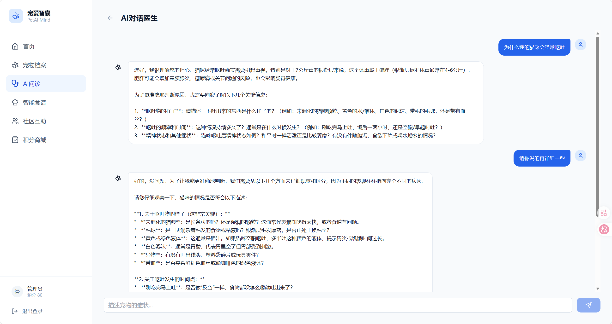
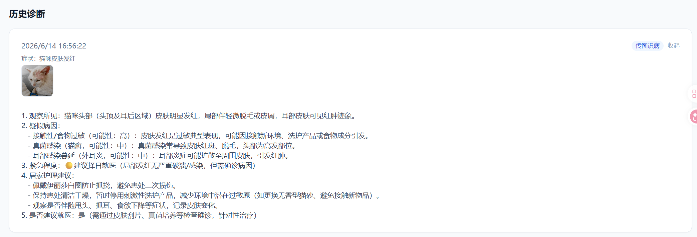
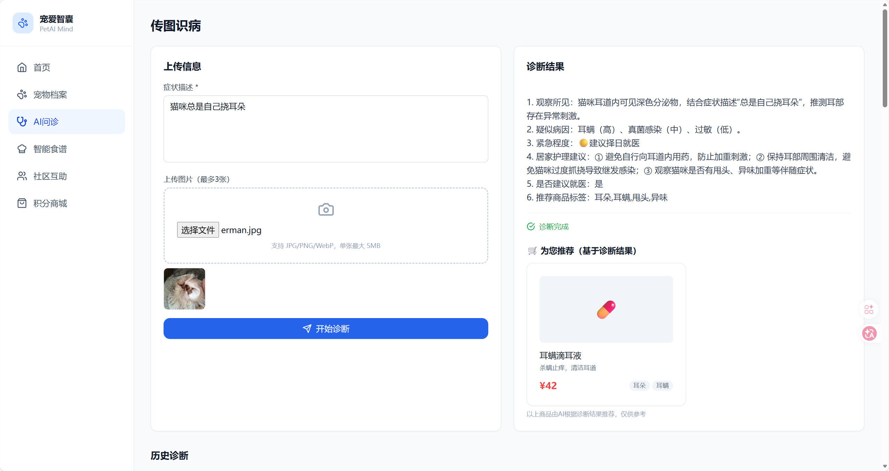
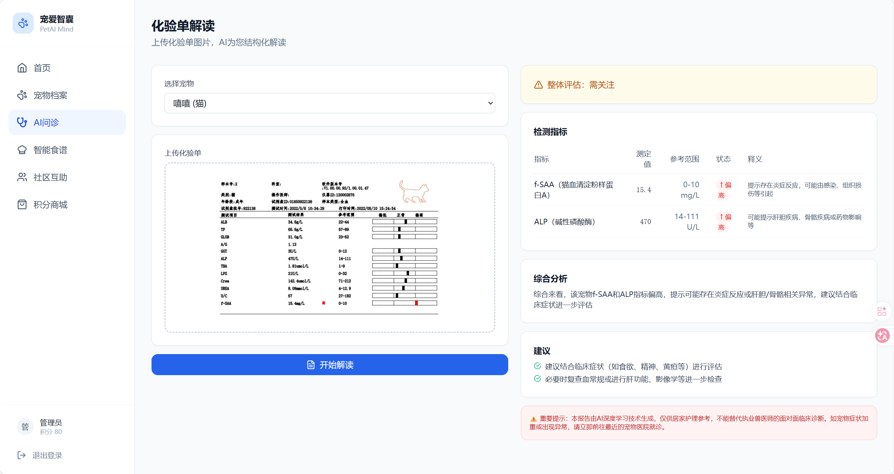

# 宠爱智囊 (PetAI Mind)

一个帮宠物主解决实际问题的工具——看不懂化验单？不确定该不该去医院？凌晨两点宠物呕吐不知道怎么办？这个项目试着用 AI 来回答这些问题。

**在线体验**：https://www.aipet.gzyhm.xyz

---

## 产品截图

|  |  |
|:---:|:---:|
|  |  |
|  |  |

---

## 做了什么

**宠物档案** — 品种、性别、生日、体重、病史、过敏史，一条条录入后形成完整档案，后面所有 AI 功能都会读取这些数据做个性化分析。

**传图识病** — 拍照上传患处，写几句症状描述，AI 会结合宠物档案给出可能的病因、紧急程度（该不该马上去医院）、居家护理建议。走 SSE 流式输出，不用等半天。

**AI 对话医生** — 不确定症状怎么描述？直接跟 AI 聊，它会追问（多久了？精神怎么样？有没有换粮？），聊 2-4 轮后出一份结构化诊断报告。

**化验单解读** — 上传化验单照片，AI 识别指标、对比参考范围、用大白话解释每个异常项是什么意思。

**智能食谱** — 根据体重自动算 RER/MER 能量需求，再结合品种和过敏史生成每日食谱，精确到克数。

**社区互助区** — 问答发帖、积分体系、积分商城，回答别人的问题可以赚积分，积分能换零食和玩具。

**AI 推荐商城** — 诊断完之后根据结果推荐相关商品（药浴液、益生菌、伊丽莎白圈之类的），点进去跳转第三方平台购买。

---

## 体验一下

在线地址：https://www.aipet.gzyhm.xyz

测试账号（随便挑一个）：

| 用户名 | 密码 | 角色 |
|--------|------|------|
| user1 | 123456 | 普通用户 |
| user2 | 123456 | 普通用户 |
| admin | 123456 | 管理员 |

登录后先建一个宠物档案（品种、体重这些），然后就可以去 AI 问诊、化验单解读、智能食谱这些功能里玩了。

---

## 本地跑起来

```bash
git clone https://github.com/Ya97779/AIPET.git
cd AIPET

# 数据库
docker compose up -d

# 后端
cd apps/api
python -m venv .venv
source .venv/bin/activate        # Windows 用 .venv\Scripts\activate
pip install -r requirements.txt
cp .env.example .env             # 里面填上你的 ZHIPU_API_KEY
alembic upgrade head
uvicorn app.main:app --reload --port 8000

# 前端
cd apps/web
npm install
npm run dev
```

`.env` 里主要改这几项：

```
ZHIPU_API_KEY=你的智谱API密钥
DB_PASSWORD=数据库密码
SECRET_KEY=随便填一个随机字符串
```

---

## 项目结构

```
AIPET/
├── apps/
│   ├── web/                  # Next.js 前端
│   │   ├── app/              # 页面路由（App Router）
│   │   ├── components/       # 组件
│   │   └── lib/              # API 客户端、工具函数
│   └── api/                  # FastAPI 后端
│       ├── app/
│       │   ├── agents/       # AI Agent（问诊、食谱、化验单）
│       │   ├── api/          # 路由
│       │   ├── models/       # 数据库模型
│       │   ├── schemas/      # Pydantic 校验
│       │   └── services/     # 业务逻辑
│       ├── alembic/          # 数据库迁移
│       └── tests/            # 测试
├── docs/                     # PRD、技术设计文档
├── docker-compose.yml        # PostgreSQL + Redis
├── deploy.sh                 # 部署脚本
└── update.sh                 # 更新脚本
```

---

## 技术栈

| 层 | 选型 |
|---|------|
| 前端 | Next.js 14 + Tailwind CSS + shadcn/ui + ECharts |
| 后端 | FastAPI + SQLAlchemy 2.0 + Alembic |
| AI | 智谱 GLM-4.6V（视觉多模态）+ GLM-4.7（文本对话） |
| 数据库 | PostgreSQL 16 + Redis 7 |
| 部署 | Docker + Nginx + HTTPS |
| 架构 | Monorepo（pnpm workspace） |

---

## 文档

- [产品需求文档 (PRD)](docs/prd.md)
- [技术设计文档](docs/superpowers/specs/2026-06-13-petai-mvp-technical-design.md)
- [商业化验证分析](PETAI商业验证分析报告.md)
- [开发 Session 总结](SESSION_SUMMARY.md)
